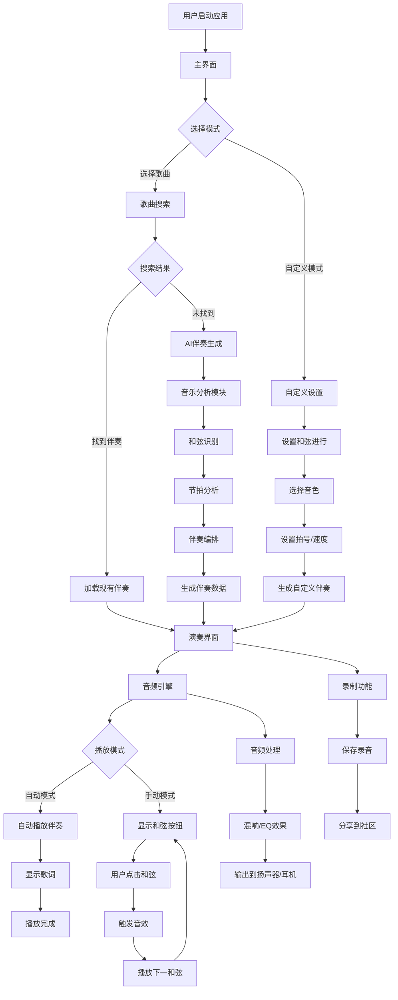

# MusicMate音乐伴奏软件可行性分析报告

## 1. 软件概述

### 核心功能
MusicMate是一款智能音乐伴奏软件，主要功能包括：
- **多乐器伴奏**：支持吉他、钢琴、贝斯、鼓等多种乐器音色的伴奏生成
- **半自动化演奏**：用户可选择全自动伴奏或手动触发和弦进行
- **AI伴奏生成**：当本地/云端无现有伴奏时，通过AI分析歌曲生成简洁和弦伴奏
- **自定义和弦进行**：用户可创建个性化的和弦序列、拍号和节拍
- **实时和弦触发**：通过点击界面按钮实现吉他扫弦、钢琴弹奏等音效
- **歌词同步显示**：配合伴奏显示歌词，便于用户跟唱

### 目标用户
- 音乐爱好者和业余歌手
- 吉他、钢琴等乐器学习者
- 街头艺人和独立音乐人
- 音乐教师和学生
- 喜欢K歌但希望有乐器伴奏的用户

### 软件价值
**解决的核心问题：**
1. **伴奏获取难题**：很多歌曲缺乏高质量的乐器伴奏，特别是吉他、钢琴等acoustic版本
2. **学习成本高**：学会弹奏乐器需要大量时间，但用户可能只想简单伴奏唱歌
3. **设备限制**：不是所有人都拥有乐器，手机伴奏更便携实用
4. **个性化需求**：用户希望调整和弦进行、节拍等个性化元素

**独特价值：**
- 降低音乐创作和演奏门槛
- 提供比纯人声伴奏更丰富的音乐体验
- 结合AI技术实现智能伴奏生成
- 支持从完全自动到手动控制的灵活演奏模式

## 2. 可行性分析

### 技术可行性 ⭐⭐⭐⭐
**核心技术需求：**
- **音频处理**：Web Audio API / Core Audio (iOS) / AAudio (Android)
- **AI音乐分析**：音乐信息检索(MIR)、和弦识别算法
- **实时音频合成**：SoundFont采样、波表合成
- **音乐理论引擎**：和弦进行分析、调性识别
- **跨平台开发**：React Native / Flutter / PWA

**技术评估：**
- ✅ **音频技术成熟**：现有音频API和库支持实时音频处理
- ✅ **AI技术可行**：开源音乐分析模型如librosa、madmom已相当成熟
- ✅ **音色库丰富**：SoundFont、采样库资源充足
- ✅ **团队能力**：需要音频工程师、AI工程师、移动开发工程师
- ⚠️ **实时性能**：移动设备音频延迟需要优化

### 经济可行性 ⭐⭐⭐⭐
**开发成本估算：**
- 团队规模：5-7人（产品经理、AI工程师、音频工程师、前后端开发、UI设计师）
- 开发周期：12-18个月
- 初期投入：150-200万人民币

**市场规模：**
- 全球音乐软件市场：约100亿美元（2024）
- 中国音乐应用用户：超过6亿人
- 目标细分市场：乐器伴奏应用，约500万潜在用户

**收益模式：**
- 免费版：基础功能 + 广告
- 高级版：¥19.9/月，包含AI生成、高级音色库、云端同步
- 一次性购买：¥198终身版
- 音色包：¥6.9-12.9/包

**ROI预测：**
- 第一年：20万用户，付费转化率8%，年收入约500万
- 第二年：50万用户，年收入约1200万
- 盈亏平衡：18个月左右

### 运行可行性 ⭐⭐⭐⭐⭐
**操作简便性：**
- ✅ **学习曲线平缓**：核心功能为"选歌-点击-伴奏"，用户易上手
- ✅ **符合使用习惯**：类似K歌软件的交互模式，用户接受度高
- ✅ **即时反馈**：点击即发声，用户体验直观
- ✅ **渐进式功能**：从简单自动伴奏到复杂手动控制，满足不同需求

**用户接受度：**
- 目标用户本身对音乐有兴趣，学习动机强
- 解决了真实痛点，用户愿意尝试新的解决方案
- 移动端使用场景丰富（家中、户外、聚会等）

### 法律可行性 ⭐⭐⭐
**主要法律风险：**
- ❗ **音乐版权**：歌曲版权、伴奏版权需要获得授权
- ❗ **AI生成内容**：需要明确AI生成伴奏的版权归属
- ✅ **技术专利**：音频处理技术相对成熟，专利风险较低

**合规策略：**
- 与音乐版权方（如腾讯音乐、网易云音乐）合作获得授权
- 建立用户上传内容的版权审核机制
- AI生成的伴奏标注为"衍生作品"，明确使用范围
- 建立DMCA机制，及时处理版权投诉

## 3. 竞争分析

### 主要竞争对手

**1. GarageBand (Apple)**
- 优势：专业音乐制作功能、高质量音色、系统深度集成
- 劣势：仅限iOS/macOS、学习门槛较高、更偏向创作而非伴奏

**2. Simply Piano / Yousician**
- 优势：良好的教学体系、用户基数大
- 劣势：主要面向学习，伴奏功能有限、缺乏AI生成能力

**3. BandLab**
- 优势：社区功能强、云端协作、免费使用
- 劣势：偏向音乐制作、界面复杂、缺乏简单伴奏模式

**4. 唱吧、全民K歌**
- 优势：用户基数庞大、社交功能完善
- 劣势：伴奏以人声为主、乐器伴奏种类有限、无AI生成

### 差异化优势（USP）

**1. AI驱动的伴奏生成**
- 独创的歌曲→和弦进行→乐器伴奏自动生成链路
- 解决伴奏资源稀缺问题

**2. 半自动化演奏体验**
- 在全自动伴奏和手动演奏间找到平衡点
- 让用户有参与感的同时降低操作难度

**3. 专注伴奏场景**
- 不做复杂的音乐制作，专注解决"想唱歌但缺乏伴奏"这一痛点
- 用户界面更简洁，学习成本更低

**4. 多元化音色支持**
- 重点发展acoustic乐器音色（吉他、钢琴、小提琴等）
- 满足不同音乐风格需求

## 4. 初步设计

### 系统架构流程图
系统整体架构采用模块化设计，包含音频引擎、AI分析引擎、用户界面和数据管理四大模块。具体流程从用户选择歌曲开始，通过本地/云端搜索或AI生成获取伴奏数据，最终通过音频引擎实现实时播放。

### UI设计思路

**设计理念：**

- 简洁直观的界面设计
- 音乐元素的视觉化表达
- 渐进式功能展示
- 深色主题突出专业感

**主要界面流程：**
1. **启动页**：品牌展示和快速入口
2. **主界面**：核心演奏区域，包含歌曲选择和基础控制
3. **歌曲选择界面**：本地/云端搜索和AI生成选项
4. **自定义设置界面**：和弦进行、拍号、音色等参数配置
5. **演奏界面**：实时和弦按钮和播放控制
6. **设置界面**：用户偏好和高级功能配置

每个界面都采用响应式设计，适配不同屏幕尺寸，并通过动画过渡提升用户体验。

### 主要功能模块

**1. 音频引擎模块**

- 实时音频合成与播放
- 多音色采样管理
- 音效处理（混响、EQ等）
- 音频延迟优化

**2. AI音乐分析模块**
- 歌曲和弦识别
- 节拍和调性分析
- 伴奏编排生成
- 音乐风格匹配

**3. 用户界面模块**
- 响应式交互设计
- 实时可视化反馈
- 手势控制支持
- 个性化设置

**4. 数据管理模块**
- 本地音乐库管理
- 云端伴奏同步
- 用户偏好存储
- 版权内容管理

## 5. 结论和建议

### 可行性总结 ⭐⭐⭐⭐

**项目优势：**

- 技术实现难度适中，现有技术栈支持良好
- 市场需求明确，目标用户群体清晰
- 商业模式成熟，多元化变现路径
- 差异化竞争优势明显
- 用户体验设计考虑周全

**主要挑战：**
- 音乐版权获取需要大量资源投入
- AI生成质量需要持续优化
- 用户获取成本可能较高
- 需要专业团队支持

**总体评估：**
该项目具有较高的可行性，值得进一步投入开发。项目解决了真实的用户痛点，技术方案可行，商业前景良好。建议采用MVP（最小可行产品）方式进行渐进式开发。

### 关键改进方向

**短期目标（0-6个月）：**

1. **MVP开发**：实现核心伴奏功能和基础UI
2. **音色库建设**：收集和优化关键乐器采样
3. **AI模型训练**：构建基础的和弦识别和生成能力
4. **版权合规**：建立初步的版权管理机制

**中期目标（6-18个月）：**
1. **功能完善**：添加高级功能如自定义和弦、音效处理
2. **AI优化**：提升生成质量，增加更多音乐风格支持
3. **社区建设**：用户分享、评价系统
4. **跨平台部署**：iOS、Android、Web全平台覆盖

**长期目标（18个月+）：**
1. **生态建设**：开放API，支持第三方插件
2. **国际化**：多语言支持，全球市场拓展
3. **技术创新**：AR/VR支持，更沉浸式的音乐体验
4. **商业拓展**：B端市场（音乐教育、娱乐场所）

### 风险控制建议

1. **版权风险**：建立专业法务团队，与版权方建立长期合作关系
2. **技术风险**：采用敏捷开发，快速迭代验证技术方案
3. **市场风险**：重视用户反馈，保持产品方向的灵活性
4. **竞争风险**：持续关注竞争对手动态，保持技术和产品优势

**项目推荐指数：⭐⭐⭐⭐☆**

MusicMate项目具有良好的市场前景和技术可行性，建议立项开发。

