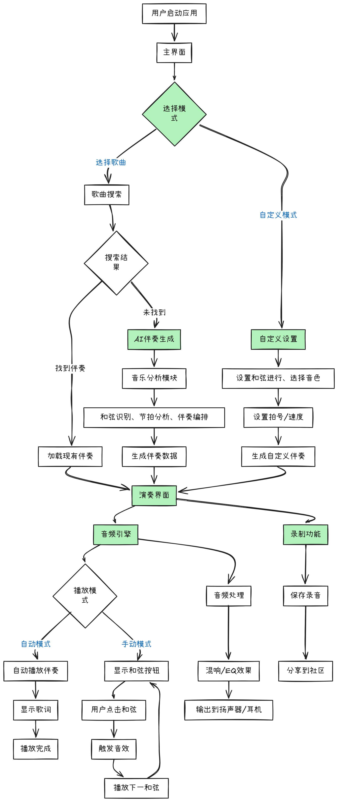
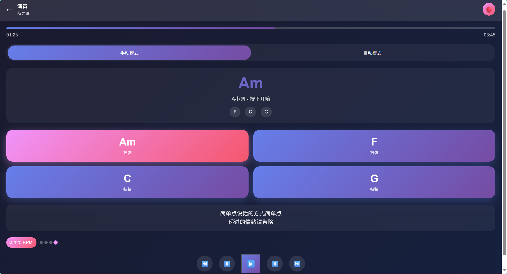
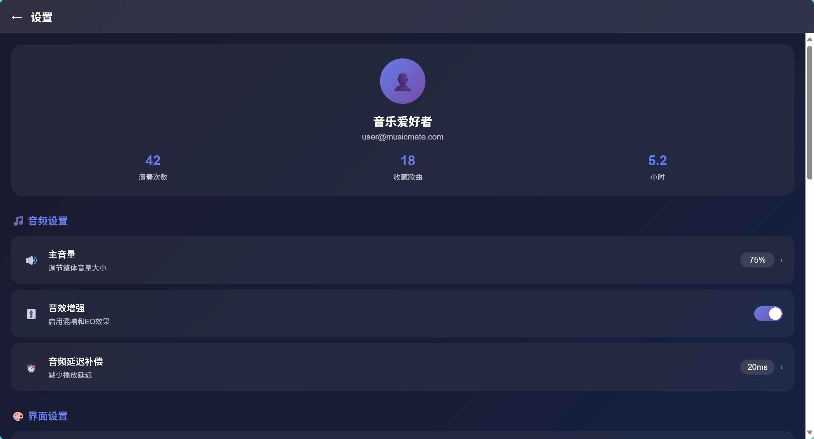

# MusicMate音乐伴奏软件可行性分析报告

## 软件概述

### 核心功能
MusicMate是一款智能音乐伴奏软件，主要功能包括：
- **多乐器伴奏**：支持吉他、钢琴、贝斯、鼓等多种乐器音色的伴奏生成
- **半自动化演奏**：用户可选择全自动伴奏或手动触发和弦进行
- **AI伴奏生成**：当本地/云端无现有伴奏时，通过AI分析歌曲生成简洁和弦伴奏
- **自定义和弦进行**：用户可创建个性化的和弦序列、拍号和节拍
- **实时和弦触发**：通过点击界面按钮实现吉他扫弦、钢琴弹奏等音效
- **歌词同步显示**：配合伴奏显示歌词，便于用户跟唱

### 目标用户
- 音乐爱好者和业余歌手
- 吉他、钢琴等乐器学习者
- 街头艺人和独立音乐人
- 音乐教师和学生
- 喜欢K歌但希望有乐器伴奏的用户

### 软件价值
 **解决的核心问题：**
1. **伴奏获取难题**：很多歌曲缺乏高质量的乐器伴奏，特别是吉他、钢琴等acoustic版本
2. **学习成本高**：学会弹奏乐器需要大量时间，但用户可能只想简单伴奏唱歌
3. **设备限制**：不是所有人都拥有乐器，手机伴奏更便携实用
4. **个性化需求**：用户希望调整和弦进行、节拍等个性化元素

**独特价值：**

- 降低音乐创作和演奏门槛
- 提供比纯人声伴奏更丰富的音乐体验
- 结合AI技术实现智能伴奏生成
- 支持从完全自动到手动控制的灵活演奏模式

---

## 可行性分析

### 技术可行性 
**核心技术需求：**

- **音频处理**：Web Audio API / Core Audio (iOS) / AAudio (Android)
- **AI音乐分析**：音乐信息检索(MIR)、和弦识别算法
- **实时音频合成**：SoundFont采样、波表合成
- **音乐理论引擎**：和弦进行分析、调性识别
- **跨平台开发**：React Native / Flutter / PWA

 **技术评估：**
- **音频技术成熟**：现有音频API和库支持实时音频处理
- **AI技术可行**：开源音乐分析模型如librosa、madmom已相当成熟
- **音色库丰富**：SoundFont、采样库资源充足
- **团队能力**：需要音频工程师、AI工程师、移动开发工程师
- **实时性能**：移动设备音频延迟需要优化

### 经济可行性 
**开发成本估算：**

- 团队规模：5-7人（产品经理、AI工程师、音频工程师、前后端开发、UI设计师）
- 开发周期：12-18个月
- 初期投入：50-100万人民币

**市场规模：**

- 全球音乐软件市场：约100亿美元（2024）
- 中国音乐应用用户：超过6亿人
- 目标细分市场：乐器伴奏应用，约500万潜在用户

**潜在收益：**

​	MusicMate项目凭借AI伴奏生成的差异化优势，预计首年吸引20万用户，8%付费转化率，通过月费制（¥19.9/月）、终身版（¥198）和音色包销售等模式实现500万元营收。第二年用户规模扩至50万，营收达1200万元，18个月内实现盈亏平衡。随着用户习惯培养和口碑传播，后期获客成本降低，利润率持续提升，为投资方提供稳定增长的投资回报。

### 运行可行性 
**操作简便性：**

-  **学习曲线平缓**：核心功能为"选歌-点击-伴奏"，用户易上手
-  **符合使用习惯**：类似K歌软件的交互模式，用户接受度高
- **即时反馈**：点击即发声，用户体验直观
- **渐进式功能**：从简单自动伴奏到复杂手动控制，满足不同需求

**用户接受度：**
- 目标用户本身对音乐有兴趣，学习动机强
- 解决了真实痛点，用户愿意尝试新的解决方案
- 移动端使用场景丰富（家中、户外、聚会等）

### 法律可行性 
**主要法律风险：**
- **音乐版权**：歌曲版权、伴奏版权需要获得授权
- **AI生成内容**：需要明确AI生成伴奏的版权归属
- **技术专利**：音频处理技术相对成熟，专利风险较低

**合规策略：**
- 与音乐版权方（如腾讯音乐、网易云音乐）合作获得授权
- 建立用户上传内容的版权审核机制
- AI生成的伴奏标注为"衍生作品"，明确使用范围
- 建立DMCA机制，及时处理版权投诉

---

## 竞争分析

### 主要竞争对手

**1. GarageBand (Apple)**
- 优势：专业音乐制作功能、高质量音色、系统深度集成
- 劣势：仅限iOS/macOS、学习门槛较高、更偏向创作而非伴奏

**2. Simply Piano / Yousician**
- 优势：良好的教学体系、用户基数大
- 劣势：主要面向学习，伴奏功能有限、缺乏AI生成能力

**3. BandLab**
- 优势：社区功能强、云端协作、免费使用
- 劣势：偏向音乐制作、界面复杂、缺乏简单伴奏模式

**4. 唱吧、全民K歌**
- 优势：用户基数庞大、社交功能完善
- 劣势：伴奏以人声为主、乐器伴奏种类有限、无AI生成、广告多、界面冗余

### 差异化优势（USP）

**1. AI驱动的伴奏生成**
- 独创的歌曲→和弦进行→乐器伴奏自动生成链路
- 解决伴奏资源稀缺问题

**2. 半自动化演奏体验**
- 在全自动伴奏和手动演奏间找到平衡点
- 让用户有参与感的同时降低操作难度

**3. 专注伴奏场景**
- 不做复杂的音乐制作，专注解决"想唱歌但缺乏伴奏"这一痛点
- 用户界面更简洁，学习成本更低

**4. 多元化音色支持**
- 重点发展acoustic乐器音色（吉他、钢琴、小提琴等）
- 满足不同音乐风格需求

---

## 初步设计

### 系统架构流程图
系统整体架构采用模块化设计，包含音频引擎、AI分析引擎、用户界面和数据管理四大模块。具体流程从用户选择歌曲开始，通过本地/云端搜索或AI生成获取伴奏数据，最终通过音频引擎实现实时播放。大致思路如下图：

### UI设计思路

**设计理念：**

- 简洁直观的界面设计
- 音乐元素的视觉化表达
- 渐进式功能展示
- 深色主题突出专业感

**主要界面流程：**

1. **启动页**：品牌展示和快速入口

	

2. **主界面**：核心演奏区域，包含歌曲选择和基础控制

  

  ---

3. **歌曲选择界面**：本地/云端搜索和AI生成选项

	

4. **自定义设置界面**：和弦进行、拍号、音色等参数配置

  

  ---

5. **演奏界面**：实时和弦按钮和播放控制

	

6. **设置界面**：用户偏好和高级功能配置

	
	
	---

### 主要功能模块

**1. 音频引擎模块**

​	负责整个应用的核心音频处理功能，通过实时音频合成与播放技术，管理多种乐器音色的采样数据，并提供混响、EQ等专业音效处理功能，同时针对移动设备特点进行音频延迟优化，确保用户在点击和弦按钮时能够获得即时且高质量的音频反馈体验。

**2. AI音乐分析模块**

​	应用的智能核心。运用先进的音乐信息检索技术对输入的歌曲进行深度分析，包括和弦识别、节拍检测、调性分析等关键音乐元素提取，并根据分析结果自动生成符合歌曲风格的乐器伴奏编排，实现从原始音乐到个性化伴奏的智能转换，为用户提供专业级的伴奏生成服务。

**3. 用户界面模块**

​	专注于创建直观友好的交互体验，采用响应式设计适配各种屏幕尺寸，通过实时可视化反馈让用户清晰了解当前演奏状态，支持触摸手势控制和个性化设置功能，确保从初学者到进阶用户都能轻松掌握应用操作，享受流畅的音乐创作过程。

**4. 数据管理模块**

​	统筹处理应用的所有数据存储和同步需求，包括本地音乐库的高效管理、云端伴奏资源的智能同步、用户个人偏好设置的安全存储，以及版权内容的合规管理，通过完善的数据架构保障用户数据安全性和应用功能的稳定性。

---

## 结论和建议

### 可行性总结 

**项目优势：**

- 技术实现难度适中，现有技术栈支持良好
- 市场需求明确，目标用户群体清晰
- 商业模式成熟，多元化变现路径
- 差异化竞争优势明显
- 用户体验设计考虑周全

**主要挑战：**
- 音乐版权获取需要大量资源投入
- AI生成质量需要持续优化
- 用户获取成本可能较高
- 需要专业团队支持

**总体评估：**
	该项目具有较高的可行性，值得进一步投入开发。项目解决了真实的用户痛点，技术方案可行，商业前景良好。

### 未来开发关键方向

​	MusicMate的未来发展应重点聚焦于AI伴奏生成质量的持续优化和音乐版权生态的建设，通过不断训练和改进AI模型来提升生成伴奏的音乐性和风格匹配度，同时建立与音乐版权方的长期合作关系以扩大曲库资源。技术层面需要加强跨平台兼容性和实时音频处理性能，特别是在低端设备上的流畅运行体验，并逐步引入社区功能和用户生成内容分享机制，形成良性的用户互动生态。商业化发展方面，应探索B端市场机会，如音乐教育机构和娱乐场所的定制化解决方案，同时关注国际化扩展的可能性，通过本地化适配和文化差异研究，将产品推向更广阔的全球市场，最终建立起以AI技术为核心、用户体验为导向、商业模式可持续的综合音乐伴奏平台。

