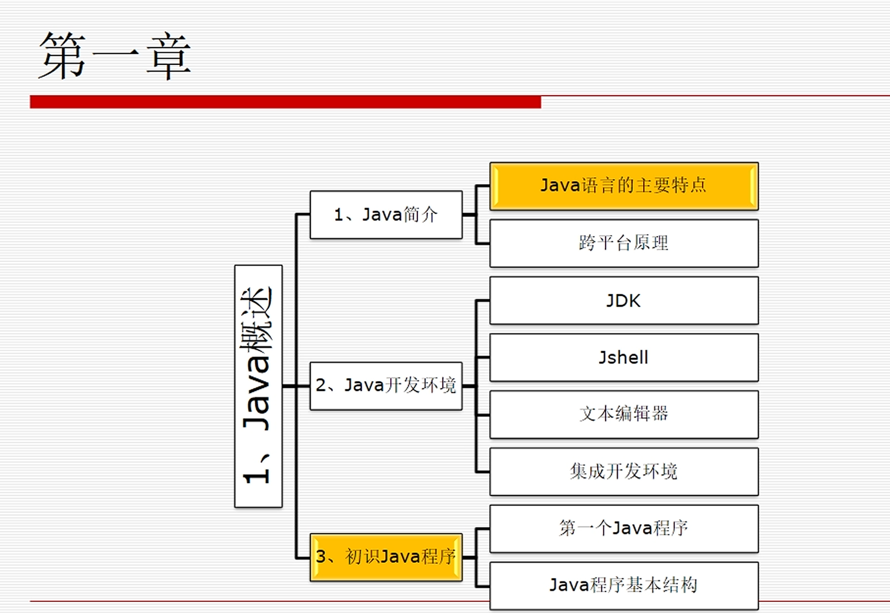
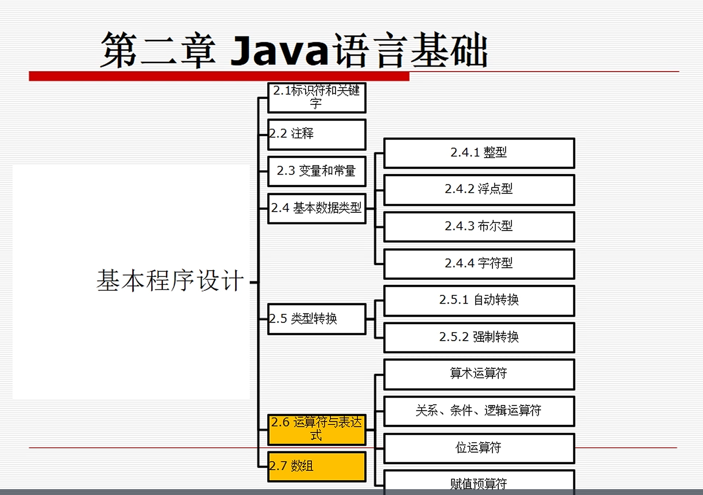
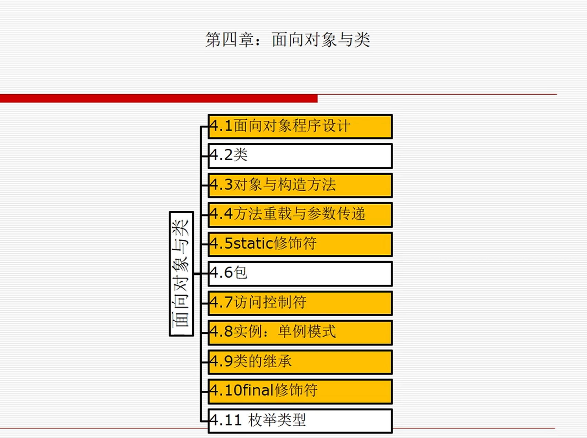
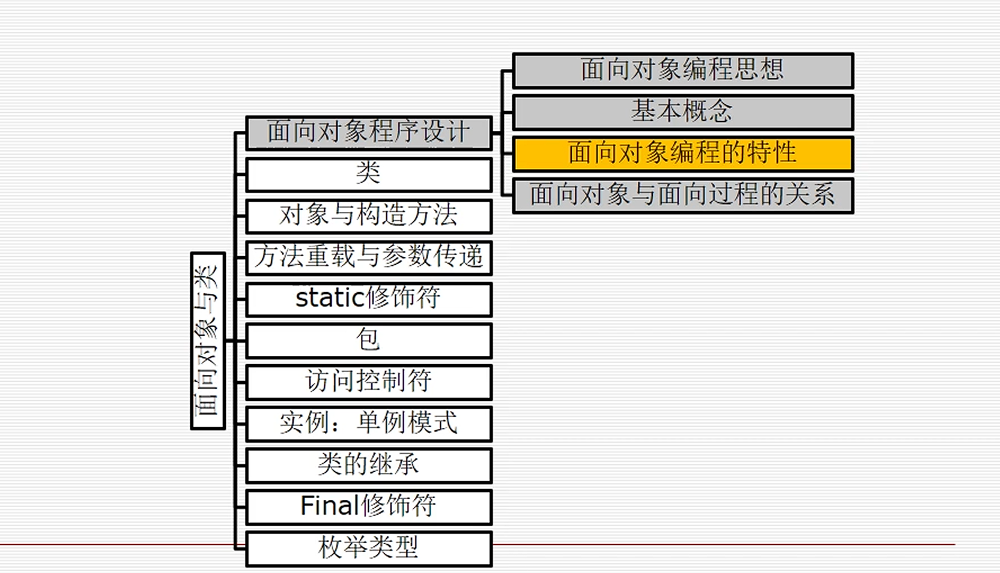
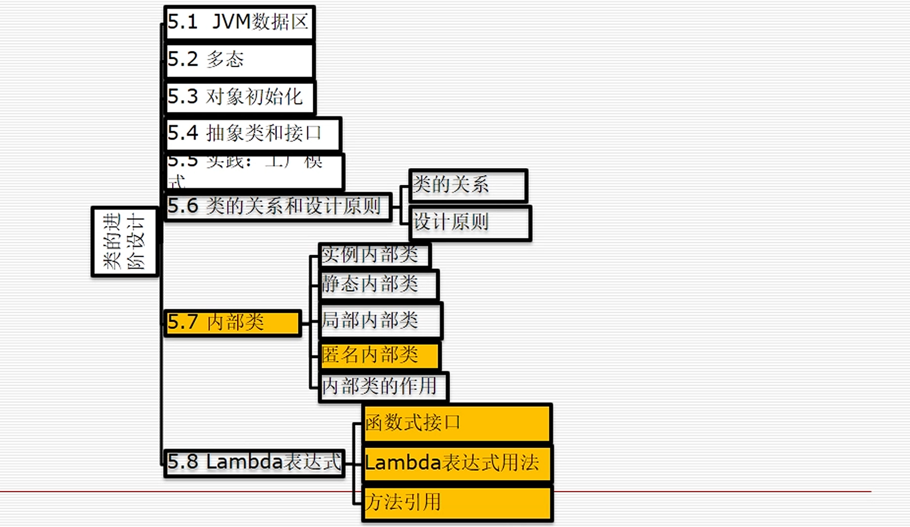
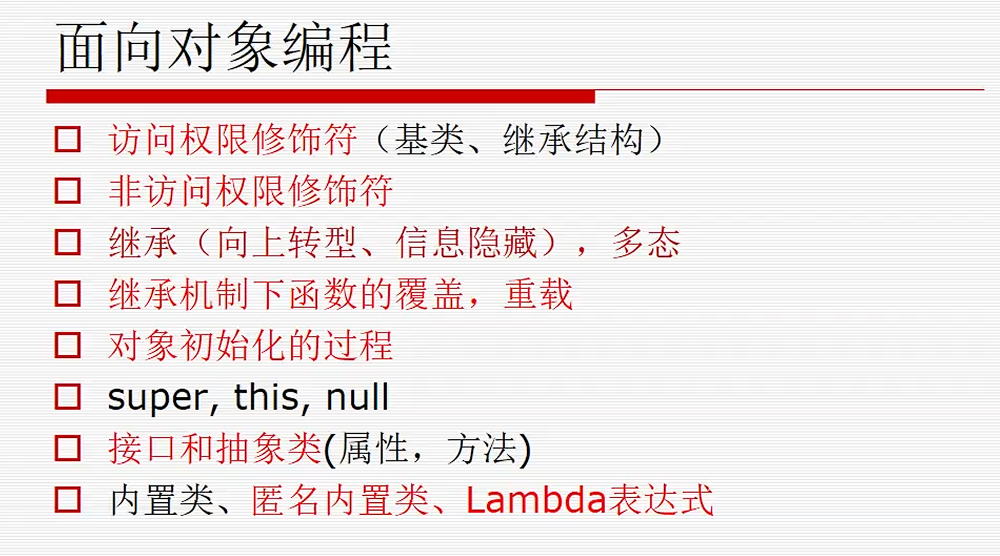
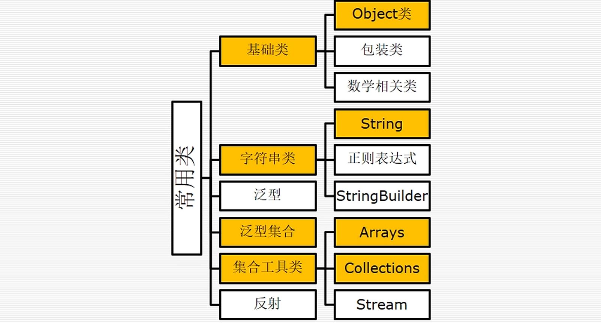
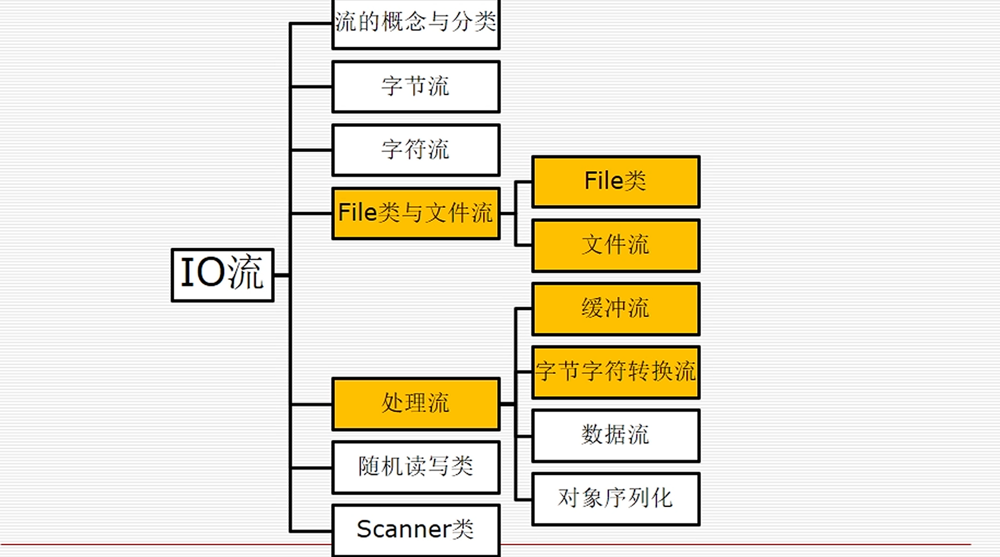
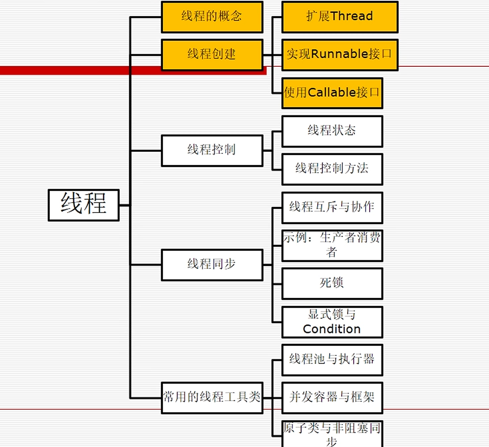
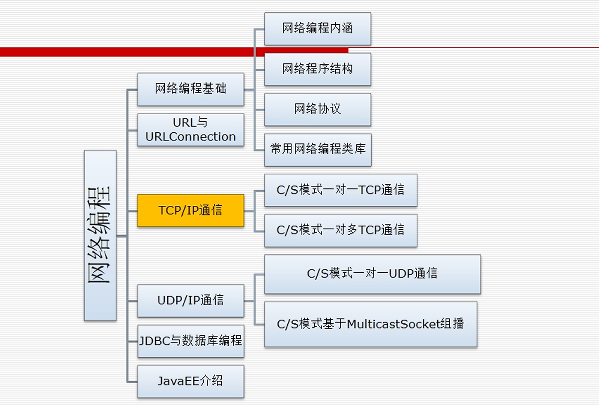

# java

## 试卷情况

1. 简答题  30
2. 程序分析、程序填空  40
3. 编写程序  30

## 重点

### 第一章 java概述

### 第二章 java语言基础

### 第三章 

基础，都重要。把课后习题都做一遍

### 第四章 面向对象与类

### 第五章 类的进阶设计

### 第六章 异常处理

会出概念题可能

### 第七章 常用类

Object类了解一下就行。泛型要会用

### 第八章 IO流

了解一下就行

### 第九章 线程与并发编程

很重要

### 第十章 图形用户界面

### 第十一章 网络编程

不做要求

### 第十二章 反射机制

