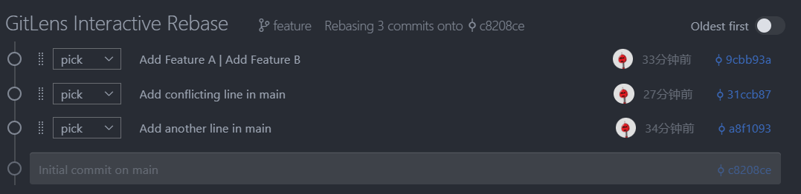

# Git学习
## **初始操作**
1. 创建本地仓库和远程仓库，并将两个仓库连接起来：
   ```bash
   git init  #初始化`
   git remote add origin ssh连接
   ```
   一般情况下，git中自动创建一个master分支。
2. 创建一个名为develop（可以任意命名此分支）的分支，更新代码。
   `git checkout -b develop`
   可以再此分支上对代码进行修改。

4. 更新完成之后,输入如下代码完成一次代码提交
    ```bash
   git add . #将所有代码添加到暂存区，然后使用 `
   git commit -m "注释"
    ```
    
5. 使用命令切换回master分支，然后完成代码合并
   ```bash
    git checkout master
    git merge develop
   ```

6. 将代码推送到GitHub：
   `git push origin master`

## 笔记
### git rebase
git rebase是用来对分支进行合并的命令，它可以把一个分支的提交历史变成另一个分支的提交历史。

1. 使用`rebase`
```bash
git checkout feature
git rebase master
```
切换到feature分支，然后把master的提交历史合并到feature分支的提交历史。

2. 出现冲突
如果出现冲突，会提示你先解决冲突，如`warning: Cannot merge binary files: readme.md (HEAD vs. 81a5937 (Add Feature A))`则说明文件readme.md存在冲突，需要手动解决冲突。正常解决即可。
解决之后，可以有一些指令：
   - `git add.` 将所有文件添加到暂存区
   - `git rebase --continue` 继续合并
   - `git rebase --abort` 放弃合并
   - `git rebase --skip` 跳过当前提交，继续下一个提交

3. 交互式`rebase`
```bash
git rebase -i HEAD~3
```
显示当前分支的前3条git记录:



*常用操作指令*：
   - `pick`：保留提交
   - `reword`：修改提交信息
   - `edit`：修改提交内容
   - `squash`：合并到前一个提交
   - `fixup` ：合并并丢弃提交信息
   - `drop` ：删除提交

### 关于.gitignore文件
直接将不需要追踪的文件写在.gitignore文件中即可，支持通配符表示。但是.gitignore对已经追踪的文件不起作用，意思是说不会删除之前已经上传过的部分。可以如下操作：
1. `git ls-files` 查看缓存中的所有文件
2. `git rm -r --cache *exe dist\` 其中-r表示递归删除，即可以删除文件夹，--cache表示删除缓存中的文件而不影响本地文件，再在右边加上需要在缓存中删除的文件即可
3. 之后再正常提交和push就可以了。

## 其他问题
### 导入github中其他分支的代码：
使用`git fetch origin`拉去远程仓库,，然后 `git reset --hard master`把其他分支的东西强制下在到本地，如果master分支和main分支无共同交集，按理此时无法将修改后的代码传入main分支，需要输入 `git pull origin main --allow-unrelated-histories`来强制把main分支的文件下载入本地，之后则正常修改即可。