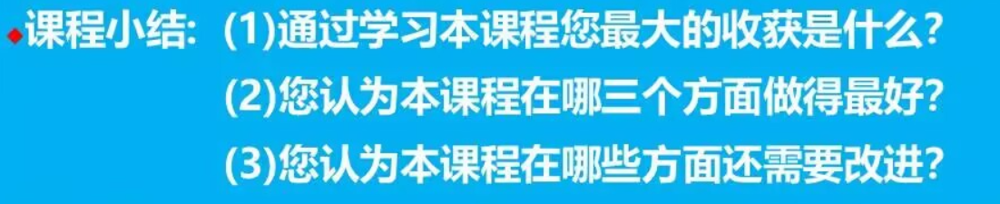

# 课程小结

## 课程最大收获

在学习《智慧能源概论》之前，我对能源问题的理解其实比较表面，更多停留在“能源够不够用”“怎样提高发电效率”这样的认识上。通过这门课的学习，我最大的收获是开始从更整体、更系统的角度去看待能源问题，意识到智慧能源并不只是某一种先进技术，而是一种面向未来的发展理念。它强调能源的安全、清洁、稳定和高效利用，也强调技术创新、管理优化与社会需求之间的协调统一，这让我对能源领域有了比以前更全面、更深入的认识。

课程中讲到能源系统、总能分析、系统建模、能源互联网和能源大数据等相关的内容。通过这些内容的学习，我逐渐明白，能源系统不是彼此孤立的环节，而是一个包含生产、传输、分配、消费和调控的复杂整体；智慧能源也不是简单地把新设备、新平台叠加起来，而是要借助数据分析、网络连接和模型方法，实现各个环节之间的高效协同。尤其是在学习能源互联网和能源大数据之后，我更深刻地感受到，未来能源的发展离不开信息技术的支撑，只有把能源流、信息流和管理决策结合起来，才能真正提升能源利用效率并推动绿色低碳转型。

我的专业是计算机科学与技术。老师在后面讲到了许多机器学习和智慧能源领域的知识。不仅让我增长了专业知识，更重要的是改变了我看待能源问题的思路，也增强了我对能源转型时代责任的理解。我认识到智慧能源建设关系到国家发展、生态保护和人民生活质量，是一个具有现实意义和长远价值的重要方向。对我个人来说，这门课让我更加明确了今后学习中应当重视系统思维、数据思维和实践能力，也让我对自己未来在相关领域继续学习和探索产生了更强的兴趣。我认为，这种认识上的提升和责任感的增强，就是这门课带给我的最大收获。

## 课堂做的最好的三个方面

1. 翻转课堂。课程后期老师鼓励我们自己上网查找资料、论文等，对选定的课题进行小组课堂汇报。这种形式非常好，可以加深学生对自己感兴趣的某一个方向的理解，同时也锻炼了我们的自主学习能力和表达能力。老师还会在课堂上对我们汇报的内容进行点评和补充，这样既能让我们在准备过程中主动思考，也能在课堂上得到专业的指导和反馈，形成了一个良好的学习循环。
2. 课堂中插入的短视频。老师在课堂上插入了一些短视频，这些视频生动形象地展示了智慧能源的应用场景和技术原理，增强了课堂的趣味性和直观性。
3. 案例分析。课程中穿插了许多实际案例，特别是关于能源互联网和能源大数据的应用案例。有一些案例非常能表现老师讲的那一个知识点，并且也有一些案例是我感兴趣的。很好。

## 需要改进的的方面

总体来说我觉得老师的教学设计和课堂内容都非常好，能够激发学生的兴趣和思考。不过如果要说需要改进的方面，我觉得可能是翻转课堂的时间拉得太长，倒是老师最开始列出的课程内容到最后讲的会不如前面细致，时间比较是有限的。当然，这也不能算不好，毕竟认真去准备一个差不多半小时流程的课堂汇报，还是让我受益匪浅。缺的那些内容我也可以自己去查看相关的资料。

另外就是我觉得老师评分依赖的东西有些杂。签到部分是在雨课堂，然后组内互评和组间互评又是在微助教，虽然每个平台都有其对应的优点，不过要是能聚合在一个平台就更好了。